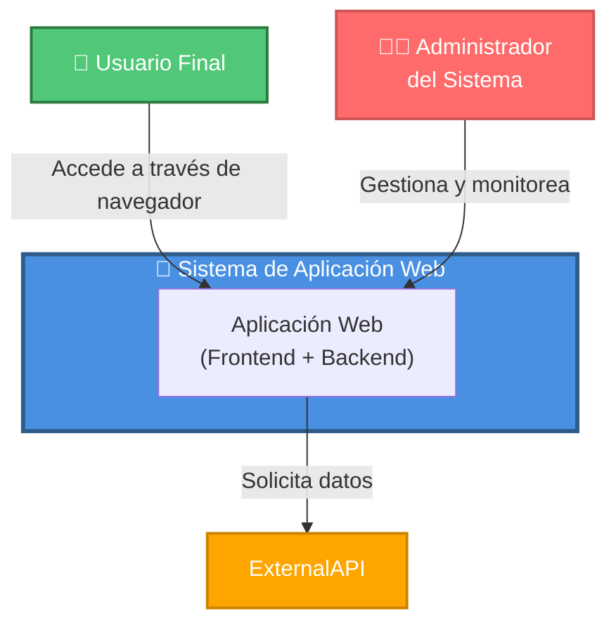
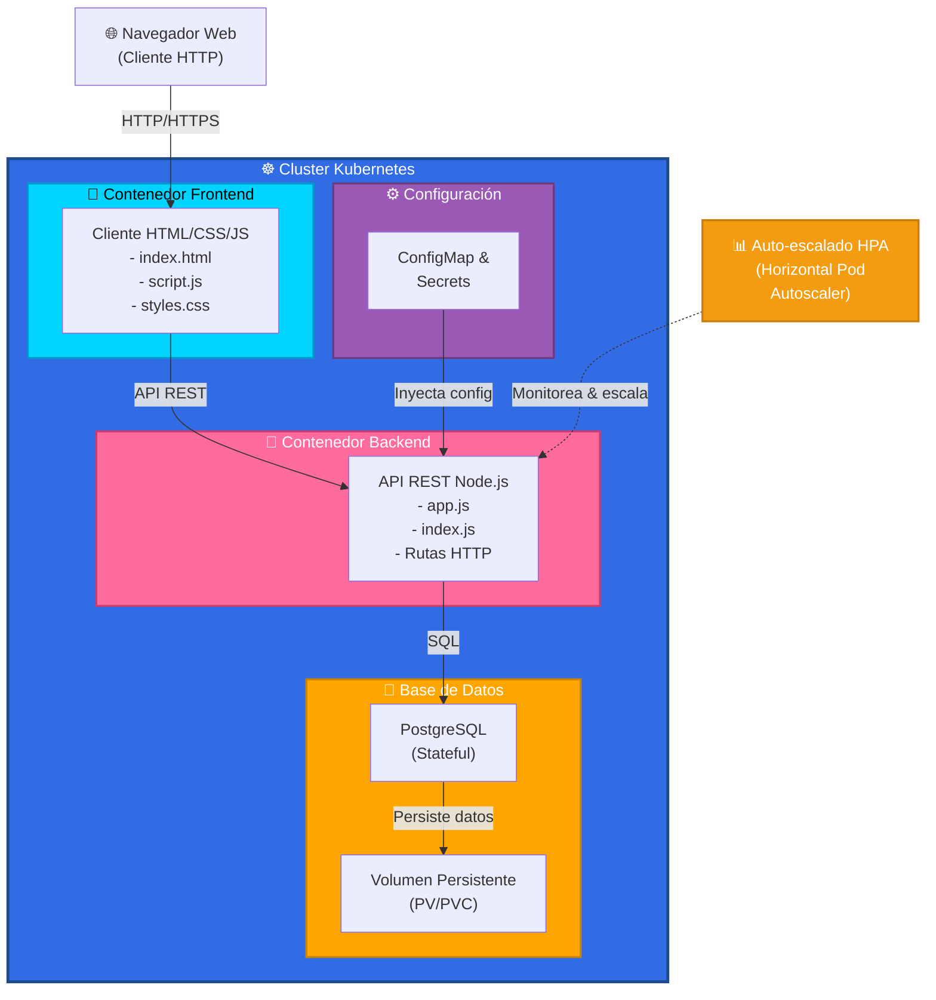
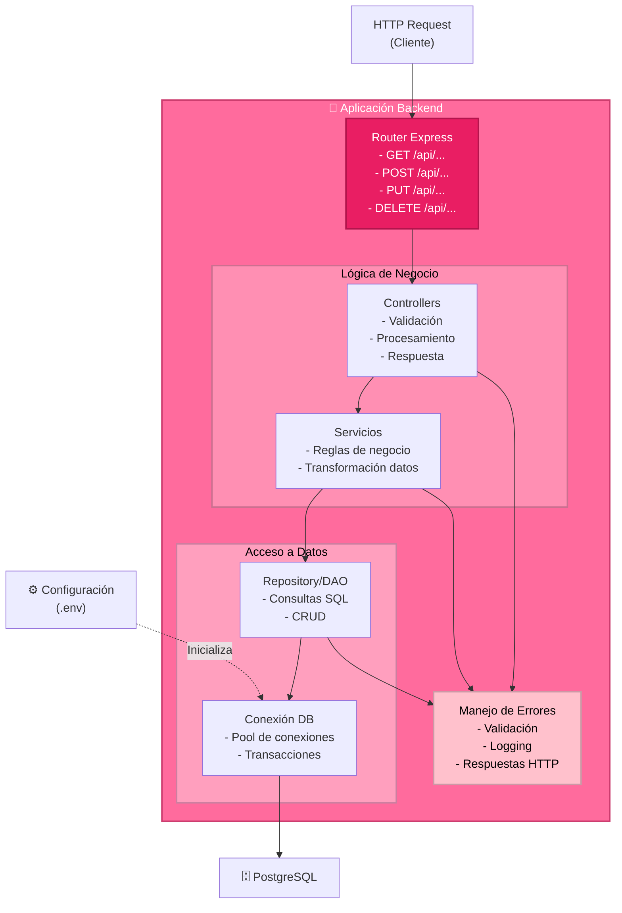
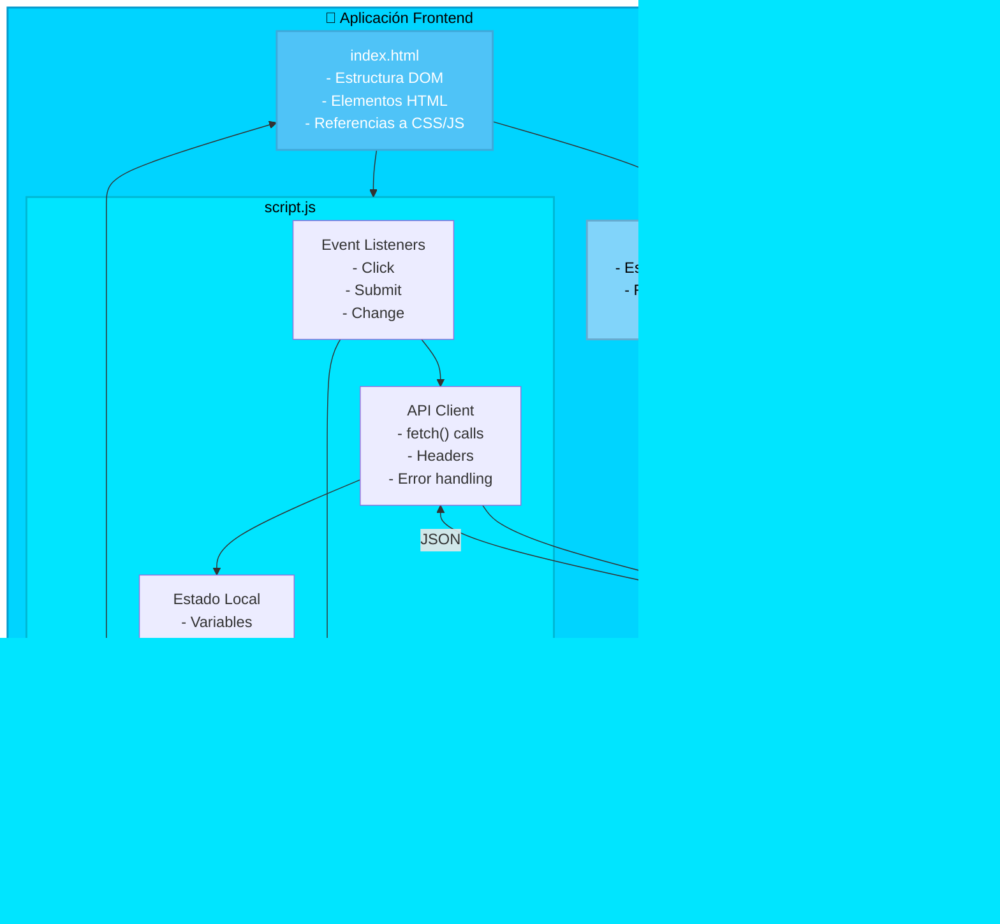
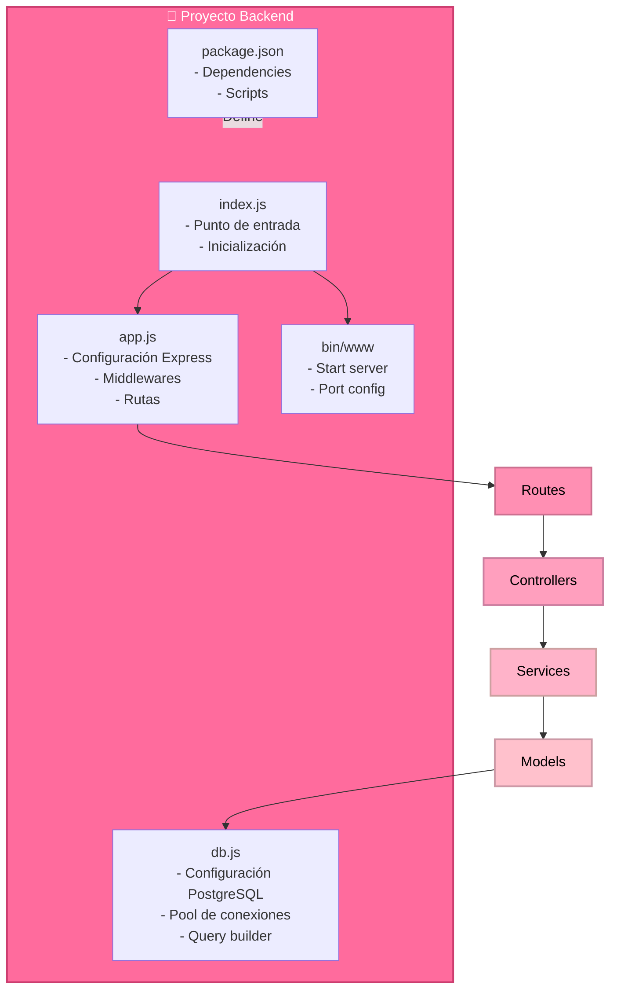
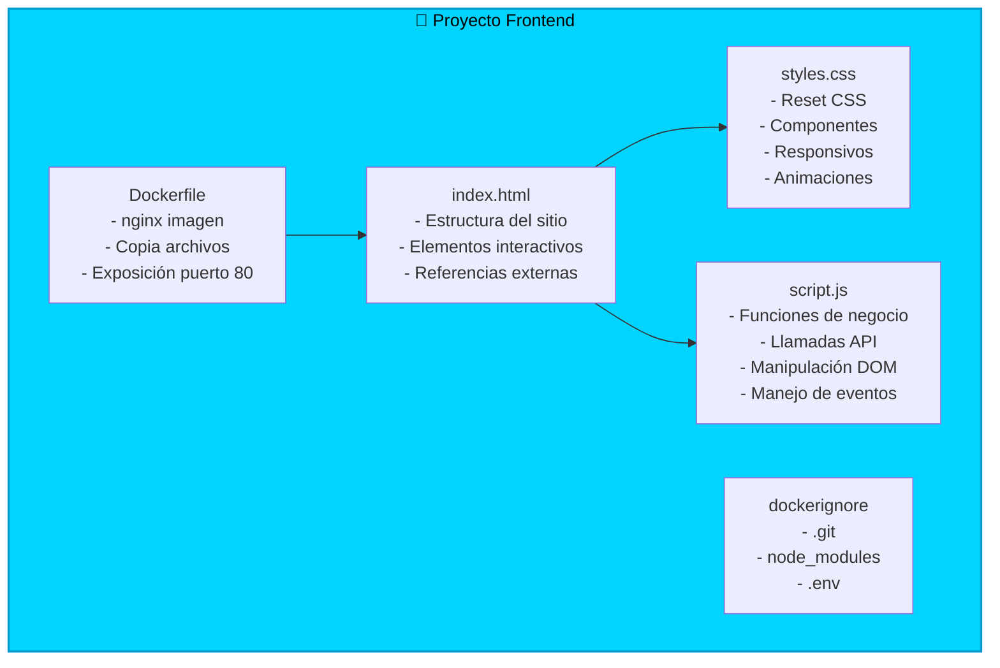

# Modelo C4 - Arquitectura de Aplicación Web Escalable

## Análisis General

La arquitectura representa una **aplicación web moderna escalable** compuesta por:
- **Frontend**: Aplicación estática (HTML/CSS/JavaScript)
- **Backend**: API REST (Node.js/Express)
- **Base de Datos**: PostgreSQL
- **Orquestación**: Kubernetes con auto-escalado (HPA)
- **Containerización**: Docker para aislamiento y portabilidad

---

## C1: Diagrama de Contexto del Sistema

Este diagrama muestra la vista de nivel más alto, representando el sistema completo y sus interactores externos.

**Descripción:**
- **Usuarios Finales**: Acceden a la aplicación web a través de navegadores HTTP/HTTPS
- **Administradores**: Gestionan la infraestructura, despliegues y monitoreo

---

## C2: Diagrama de Contenedores

Este nivel muestra los contenedores principales, sus responsabilidades y cómo se comunican.

**Componentes Principales:**

| Contenedor | Responsabilidad | Tecnología |
|-----------|-----------------|-----------|
| **Frontend** | Interfaz de usuario estática | HTML5, CSS3, JavaScript |
| **Backend** | Lógica de negocio, API REST | Node.js, Express |
| **Database** | Persistencia de datos | PostgreSQL |
| **ConfigMap/Secrets** | Configuración y variables sensibles | Kubernetes |
| **HPA** | Auto-escalado automático | Kubernetes |

---

## C3: Diagrama de Componentes

### Backend - Componentes Internos

### Frontend - Componentes Internos

---

## C4: Diagrama de Código

### Backend - Estructura de Archivos y Clases

### Frontend - Estructura de Archivos

