# Modelo C4 - Arquitectura de Persistencia

Aplicación de gestión de tareas (todos) desplegada en Kubernetes con PostgreSQL, StatefulSets y PersistentVolumes.

## Estrategias de Persistencia

- **Base de Datos**: PostgreSQL en StatefulSet con PVC (10Gi)
- **Configuración**: ConfigMap (no-sensible) + K8s Secrets (credenciales)
- **Pool de Conexiones**: `pg.Pool` con 30-40 conexiones máximas
- **Assets**: Static frontend desde contenedor; posible mejora con S3

---

## Diagramas C4

### **NIVEL 1: System Context (Contexto del Sistema)**

```mermaid
---
config:
  look: neo
  theme: neo
---
graph
    User["👤 Usuario Final"]
    Frontend["🌐 Aplicación Web<br/>(Frontend)"]
    Backend["⚙️ API REST<br/>(Backend)"]
    Database["🗄️ PostgreSQL<br/>(Base de Datos)"]
    K8s["☸️ Kubernetes<br/>(Orquestador)"]
    
    User -->|Interactúa| Frontend
    Frontend -->|Solicita datos| Backend
    Backend -->|Lee/Escribe| Database
    K8s -->|Orquesta| Backend
    K8s -->|Orquesta| Database
    
    style User fill:#e1f5ff
    style Frontend fill:#fff3e0
    style Backend fill:#f3e5f5
    style Database fill:#e8f5e9
    style K8s fill:#fce4ec
```



---

### **NIVEL 2: Container (Contenedores)**

```mermaid
---
config:
  look: neo
  theme: neo
---
graph
    Client["👤 Cliente HTTP"]
    
    subgraph K8s["Kubernetes Cluster"]
        subgraph FrontendPod["Pod: nginx-frontend"]
            Frontend["🌐 Frontend Container<br/>- HTML/CSS/JS<br/>- Port: 80"]
        end
        
        subgraph BackendPod["Pod: app-backend"]
            Backend["⚙️ Backend Container<br/>- Express.js<br/>- Node.js Runtime<br/>- Port: 3000"]
        end
        
        subgraph DBStatefulSet["StatefulSet: postgres"]
            DB["🗄️ PostgreSQL Container<br/>- postgres:15-alpine<br/>- Port: 5432"]
            PVC["💾 PersistentVolumeClaim<br/>- Almacenamiento: 10Gi<br/>- Access Mode: ReadWriteOnce"]
        end
        
        CM["⚙️ ConfigMap<br/>PGHOST=postgres<br/>PGPORT=5432<br/>PGDATABASE=todos"]
        
        Secret["🔐 Kubernetes Secret<br/>POSTGRES_PASSWORD<br/>PGUSER=postgres"]
    end
    
    Client -->|HTTP/HTTPS| Frontend
    Frontend -->|API Calls| Backend
    Backend -->|pg.Pool| DB
    Backend -.->|Inyección| CM
    Backend -.->|Inyección| Secret
    DB --> PVC
    
    style Client fill:#e1f5ff
    style Frontend fill:#fff3e0
    style Backend fill:#f3e5f5
    style DB fill:#e8f5e9
    style PVC fill:#c8e6c9
    style CM fill:#fff9c4
    style Secret fill:#f8bbd0
```



---

### **NIVEL 3: Component (Componentes del Backend)**

```mermaid
---
config:
  look: neo
  theme: neo
---
graph
    Client["👤 HTTP Request"]
    
    subgraph Express["Express Application"]
        Router["📍 Router<br/>- GET /todos<br/>- POST /todos<br/>- DELETE /todos/:id"]
        
        Middleware["🔌 Middleware<br/>- CORS<br/>- Body Parser<br/>- Morgan Logger"]
        
        ErrorHandler["⚠️ Global Error Handler<br/>- 404 Handler<br/>- Exception Catcher"]
    end
    
    subgraph Database["Database Layer"]
        Pool["🔄 Connection Pool<br/>- pg.Pool<br/>- Max connections: 30-40<br/>- Idle timeout: 30s"]
        
        Init["🚀 Database Initializer<br/>- CREATE TABLE IF EXISTS<br/>- Setup schema"]
        
        Query["📝 Query Executor<br/>- Prepared Statements<br/>- Parameterized queries"]
    end
    
    subgraph Persistence["Storage"]
        PostgreSQL["🗄️ PostgreSQL DB<br/>Table: todos<br/>- id: SERIAL PK<br/>- value: TEXT<br/>- created_at: TIMESTAMPTZ"]
    end
    
    Client --> Middleware
    Middleware --> Router
    Router --> Query
    Query --> Pool
    Pool --> Init
    Init --> PostgreSQL
    
    style Router fill:#f3e5f5
    style Middleware fill:#e0f2f1
    style ErrorHandler fill:#ffebee
    style Pool fill:#fff9c4
    style Init fill:#fff3e0
    style PostgreSQL fill:#e8f5e9
```



---

### **NIVEL 4: Código - Estrategia de Persistencia y Configuración de Conexión (db.js)**

```javascript
const { Pool } = require('pg');

const pool = new Pool({
  host: process.env.PGHOST || 'localhost',
  port: parseInt(process.env.PGPORT || '5432'),
  database: process.env.PGDATABASE || 'todos',
  user: process.env.PGUSER || 'postgres',
  password: process.env.PGPASSWORD || '',
  idleTimeoutMillis: 30000
});

async function init() {
  const client = await pool.connect();
  try {
    await client.query(`CREATE TABLE IF NOT EXISTS todos (
      id SERIAL PRIMARY KEY,
      value TEXT NOT NULL,
      created_at TIMESTAMPTZ DEFAULT NOW()
    )`);
  } finally {
    client.release();
  }
}

module.exports = { query: (text, params) => pool.query(text, params), pool, init };
```

---

## Alternativas Consideradas

### 1. **Base de Datos**
| Opción | Pros | Contras |
|--------|------|---------|
| **PostgreSQL (Actual)** | ACID, JSON, Escalable | Requiere StatefulSet, más recursos |
| **MongoDB** | Schema flexible, fácil de escalar | No ACID, más memoria |
| **SQLite** | Simple, sin dependencias | No es distribuida, no escalable |

### 2. **Almacenamiento**
| Opción | Ventajas | Desventajas |
|--------|----------|-------------|
| **PVC Local** | Rápido, simple | Acoplado a nodo, no replicado |
| **NFS** | Compartido entre nodos | Latencia de red, SPOF |
| **Cloud Storage** | Escalable, replicado | Latencia mayor, costo |
| **Ceph/Rook** | Distribuido, resiliente | Complejidad operacional |

### 3. **ORM/Query Builder**
| Opción | Pros | Contras |
|--------|------|---------|
| **SQL Directo (Actual)** | Rendimiento máximo, control | Vulnerable a SQL injection si no es cuidadoso |
| **Prisma** | Type-safe, generador de tipos | Overhead de abstracción |
| **TypeORM** | Decoradores, relaciones | Complejidad adicional |
| **Sequelize** | Validaciones, hooks | Menos performante |
